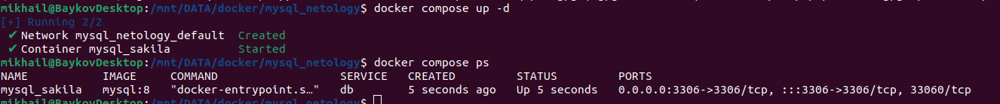
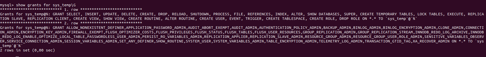
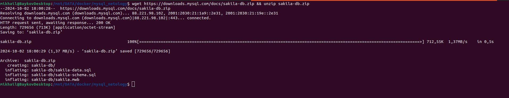
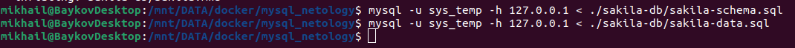
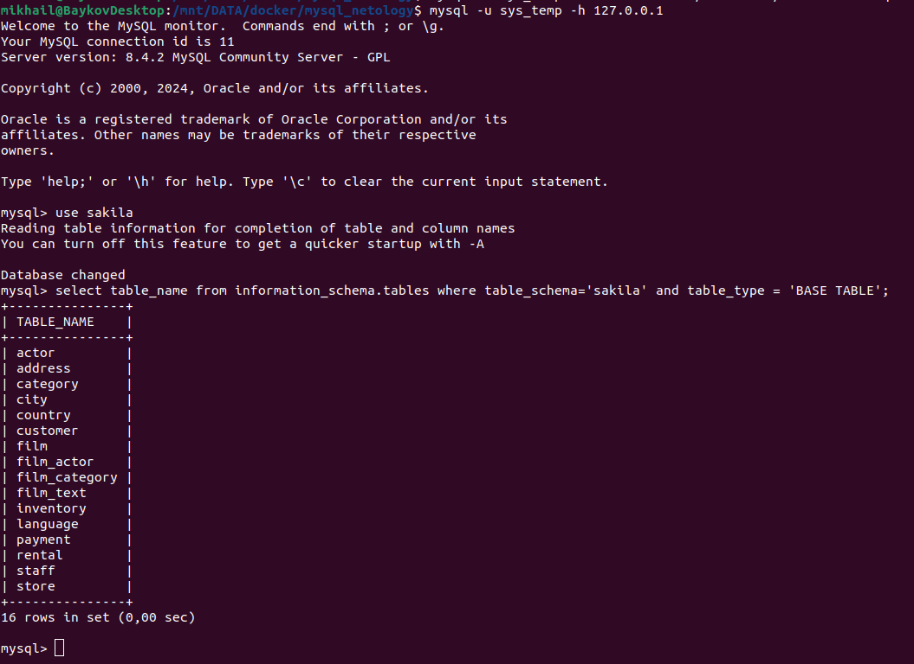
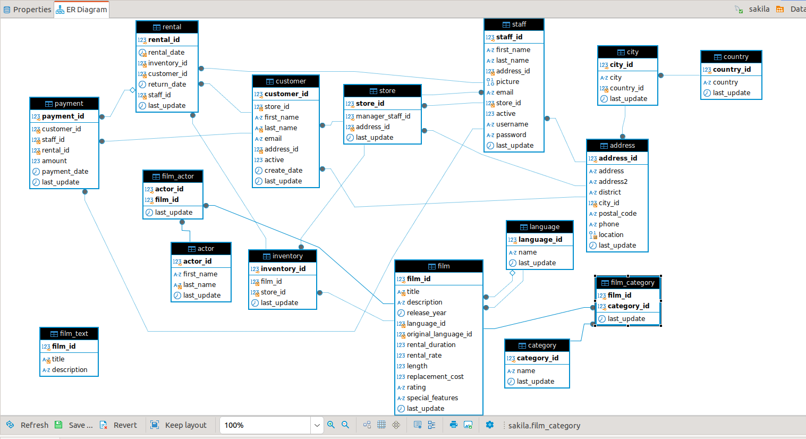
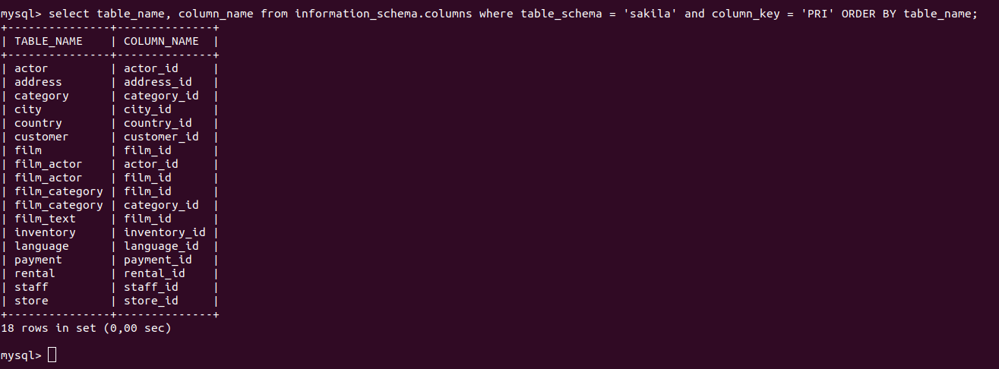

# Домашнее задание к занятию "`Работа с данными (DDL/DML)`" - `Байков Михаил`

### Задание 1
1.1. Поднимите чистый инстанс MySQL версии 8.0+. Можно использовать локальный сервер или контейнер Docker.

1.2. Создайте учётную запись sys_temp. 

1.3. Выполните запрос на получение списка пользователей в базе данных. (скриншот)

1.4. Дайте все права для пользователя sys_temp. 

1.5. Выполните запрос на получение списка прав для пользователя sys_temp. (скриншот)

1.6. Переподключитесь к базе данных от имени sys_temp.

Для смены типа аутентификации с sha2 используйте запрос: 
```sql
ALTER USER 'sys_test'@'localhost' IDENTIFIED WITH mysql_native_password BY 'password';
```
1.6. По ссылке https://downloads.mysql.com/docs/sakila-db.zip скачайте дамп базы данных.

1.7. Восстановите дамп в базу данных.

1.8. При работе в IDE сформируйте ER-диаграмму получившейся базы данных. При работе в командной строке используйте команду для получения всех таблиц базы данных. (скриншот)

*Результатом работы должны быть скриншоты обозначенных заданий, а также простыня со всеми запросами.*

### Решение 1
1.1 Запускаем MySQL

1.2 Подключаемся к БД и создаем учетку sys_temp

1.3 Получаем список пользователей в БД

1.4 Даем права пользователю sys_temp

1.5 получаем список прав sys_temp 

1.6 Качаем и распаковываем дамп.

1.7 Восстанавливаем дамп.

1.8 Получаем список таблиц в БД sakila исключая вьюхи. Смотрим ER-диаграмму.
```
select table_name from information_schema.tables where table_schema='sakila' and table_type = 'BASE TABLE';
```




### Задание 2
Составьте таблицу, используя любой текстовый редактор или Excel, в которой должно быть два столбца: в первом должны быть названия таблиц восстановленной базы, во втором названия первичных ключей этих таблиц. Пример: (скриншот/текст)
```
Название таблицы | Название первичного ключа
customer         | customer_id
```

### Решение 2
Получаем список первичных ключей из БД sakila.
```
select table_name, column_name from information_schema.columns where table_schema = 'sakila' and column_key = 'PRI' ORDER BY table_name;
```

